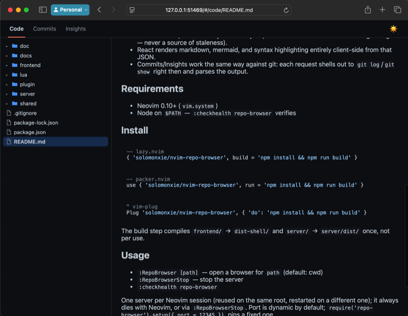

# Live Repo Browser for Neovim

Why: sometimes you just want to quickly browse a repo's README/code
locally, the easy GitHub way, without pushing to a remote first.

A GitHub-like file browser for any local repo, hosted entirely by Neovim.
`:RepoBrowser` spawns a live server and opens your browser; quitting Neovim
shuts it down. Every click reads disk fresh — no regenerate step. Markdown,
mermaid diagrams, and syntax highlighting all render client-side in React;
dark by default, toggle in the top bar. Code/Commits/Insights tabs, like
GitHub.

See `docs/design/repo-browser.md` (why) and `docs/design/repo-browser-plan.md`
(implementation plan).

## How it works
- `:RepoBrowser` spawns a Node server (`server/`) scoped to your repo,
  killed when Neovim quits.
- The server serves a prebuilt React app (`frontend/` → `dist-shell/`,
  built once) plus a JSON API — it never renders anything itself, only reads.
- Every click is a live `fetch()`: the server `stat()`s the target at that
  instant and returns fresh content (an in-memory cache only skips a
  redundant re-read when nothing changed — never a source of staleness).
- React renders markdown, mermaid, and syntax highlighting entirely
  client-side from that JSON.
- Commits/Insights work the same way against git: each request shells out
  to `git log`/`git show` right then and parses the output.

## Requirements
- Neovim 0.10+ (`vim.system`)
- Node on `$PATH` — `:checkhealth repo-browser` verifies

## Install

```lua
-- lazy.nvim
{ 'solomonxie/nvim-repo-browser' }
```
```lua
-- packer.nvim
use 'solomonxie/nvim-repo-browser'
```
```vim
" vim-plug
Plug 'solomonxie/nvim-repo-browser'
```

No build hook needed — the first `:RepoBrowser` self-builds
(`npm install && npm run build`, compiling `frontend/` → `dist-shell/` and
`server/` → `server/dist/`) if it isn't built yet, a one-time delay. Add a
`build`/`run`/`do` hook with that same command if you'd rather it happen at
install/update time instead of on first use.

## Usage
- `:RepoBrowser [path]` — open a browser for `path` (default: cwd)
- `:RepoBrowserStop` — stop the server
- `:checkhealth repo-browser`

One server per Neovim session (reused on the same root, restarted on a
different one); it always dies with Neovim, or via `:RepoBrowserStop`.
Port is dynamic by default; `require('repo-browser').setup({ port = 12345 })`
pins a fixed one.

## Limitations
- No full-text search, no git blame/diff-outside-of-commits — current
  working tree + commit history only
- No syntax highlighting for Terraform/HCL (not in highlight.js)
- Freshness is per click/reload, not push — an already-open tab needs a
  reload to see an edit

## Screenshot


